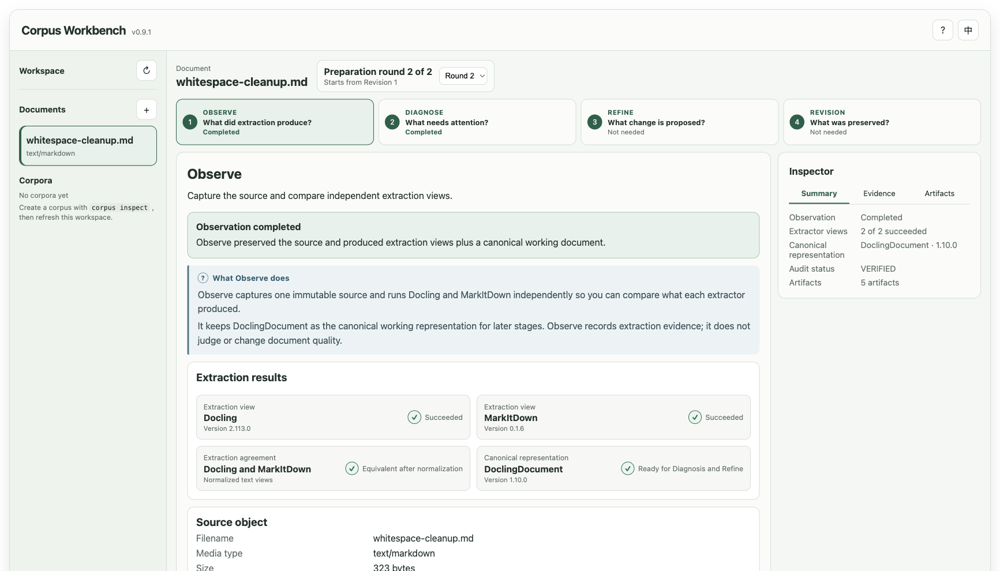

# tiny-corpus-workbench

English | [简体中文](README.zh-CN.md)

Learn how to prepare documents for a corpus without hiding the evidence or
overwriting history.

`tiny-corpus-workbench` is a learning-first project for the work that happens
before chunking, embeddings, retrieval, and generation. It makes document
preparation visible as one inspectable lifecycle. You can study the principles,
practice them in a local visual Workbench, or run the same mechanics through a
direct CLI.

[Project website](https://lifeplayer.space/tiny-corpus-workbench/) ·
[Learning Guides](https://lifeplayer.space/tiny-corpus-workbench/learn/) ·
[Releases](https://github.com/jameswei/tiny-corpus-workbench/releases)



## Why this project exists

A raw document is not automatically trustworthy corpus material. Extraction can
expose layout noise, structural traps, ambiguous text, and differences between
tools. Silent cleanup makes these conditions difficult to study and audit.

This project keeps the preparation path visible:

```text
raw source
    -> independent extraction views
    -> canonical DoclingDocument
    -> evidence-based diagnosis
    -> supported proposal + explicit human decision
    -> immutable prepared revision
    -> corpus-level inspection
```

The learner can answer four concrete questions:

1. What did each extractor produce?
2. Which condition needs attention, and what evidence supports it?
3. Which change is proposed, and who decides whether it happens?
4. Which revision was created, and what history was preserved?

## What makes it useful for learning

- **Evidence remains inspectable.** Sources, extraction views, findings,
  proposals, decisions, transformations, hashes, and revisions remain visible.
- **Diagnosis and authority stay separate.** A finding can identify a condition.
  It cannot approve a document change.
- **Changes are explicit and reversible.** An approved refinement creates a new
  revision and records the exact operation. It does not overwrite the source.
- **The same core supports every interface.** The guides, Workbench, and CLI use
  the same project-owned application and domain services.
- **The boundary stays clear.** The project ends at a prepared document
  revision. Downstream RAG work remains outside the project.

## Three ways to learn

| Interface | Best for | What it provides |
| --- | --- | --- |
| [Learning Guides](https://lifeplayer.space/tiny-corpus-workbench/learn/) | Understanding the principles | A bilingual course that explains each lifecycle stage and connects it to a practical Workbench exercise |
| Local Workbench | Seeing and practicing the lifecycle | A learner-oriented browser interface with Documents and Corpora navigation, preparation rounds, readable comparisons, explicit decisions, and focused evidence |
| `corpus` CLI | Repeating and verifying the mechanics | The complete lifecycle, record-producing commands, and independent read-only verification commands |

The Workbench and CLI can use the same local workspace. They are two interfaces
over the same preparation mechanics, not separate demo implementations.

## Start with the Local Workbench

The project requires CPython 3.12. Clone the repository, create a virtual
environment, and install the project:

```bash
python3.12 -m venv .venv
source .venv/bin/activate
python -m pip install -e .
```

Start the Workbench:

```bash
corpus workbench
```

The command prints the local address and normally opens it in your browser.
Stop the server with `Ctrl-C`.

Select **Add a document**, then choose the guided
`whitespace-cleanup.md` example. Follow these stages:

1. **Observe** the source metadata and two extraction views.
2. **Diagnose** the canonical document and inspect finding D009.
3. **Refine** the supported R001 proposal.
4. **Approve** or **Reject**, then record the decision.
5. **Revision** shows the resulting history and any prepared document.
6. **Corpora** shows aggregate evidence when corpus records exist.

This model-free Markdown path is the shortest complete exercise. You do not
need to edit JSON.

The Workbench can also observe one local `.docx`, `.md`, `.pdf`, or
`.txt` file up to 32 MiB. Uploaded originals are recorded locally but are not
rendered or served back in the browser.

## Run the same lifecycle with the CLI

The CLI is useful when you want to inspect raw command output or repeat every
step yourself:

```bash
corpus observe fixtures/refinement/whitespace-cleanup.md
corpus verify OBSERVATION_DIRECTORY

corpus diagnose OBSERVATION_DIRECTORY
corpus verify-diagnosis DIAGNOSIS_DIRECTORY \
  --subject OBSERVATION_DIRECTORY

corpus draft-refinement DIAGNOSIS_DIRECTORY \
  --finding FINDING_ID \
  --base OBSERVATION_DIRECTORY \
  --output proposal.json

corpus resolve-refinement proposal.json \
  --diagnosis DIAGNOSIS_DIRECTORY \
  --base OBSERVATION_DIRECTORY \
  --approve

corpus verify-refinement REFINEMENT_DIRECTORY \
  --diagnosis DIAGNOSIS_DIRECTORY \
  --base OBSERVATION_DIRECTORY
```

Inspect `proposal.json`, but do not edit it. Supply exactly one decision flag:
`--approve` or `--reject`.

Inspect an explicit corpus and verify its published record:

```bash
corpus inspect fixtures/corpus/golden-matrix.json
corpus verify-corpus CORPUS_DIRECTORY \
  --spec fixtures/corpus/golden-matrix.json
```

Use `corpus --help` or a subcommand `--help` for the complete option list.

## What the project produces

Record-producing commands publish new directories. They do not overwrite
previous records.

| Record | Main contents | Learning purpose |
| --- | --- | --- |
| Observation | Source identity, extraction results, canonical content, and comparison evidence | See what extraction produced and how independent views differ |
| Diagnosis | Findings, affected items, severity, and a readable report | Connect a quality condition to concrete evidence |
| Refinement | Proposal, explicit decision, report, and approved transformation history | Separate a suggested change from the authority to apply it |
| Prepared revision | Canonical content, derived Markdown, hashes, and lineage | Inspect the new revision without losing the source or prior history |
| Corpus | Explicit members, aggregate evidence, summary, and offline report | Compare prepared-document evidence across a small corpus |

Lossless `DoclingDocument` JSON is the canonical document representation.
Markdown and HTML are derived views for people. The static corpus report works
offline and contains no arbitrary source passages.

## Optional PDF models

The guided Markdown exercise does not need model downloads. PDF extraction uses
local Docling models. Download them once while network access is available:

```bash
docling-tools models download layout tableformer \
  --output-dir .cache/docling/models
```

Observation does not download models automatically. If required models are
missing, it records the extraction failure as evidence.

## Trust model and boundary

The Workbench binds to `127.0.0.1`. It trusts the local user and local
processes. It is not a hosted service, a public API, or a multi-user system.

Original sources and raw extraction artifacts remain immutable. Diagnosis does
not authorize mutation. A refinement changes a document only after an explicit
human decision. Local hashes and verification detect ordinary corruption; they
do not establish authorship, authenticity, or a trusted timestamp.

The project deliberately stops at a prepared document revision. Chunking,
embeddings, indexing, retrieval, generation, and RAG evaluation remain
downstream.

## Continue learning

The bilingual [Learning Guides](https://lifeplayer.space/tiny-corpus-workbench/learn/)
follow the same lifecycle as the Workbench:

1. prepare documents before downstream use;
2. capture a source and inspect extraction;
3. diagnose with evidence;
4. decide and create an immutable revision;
5. inspect a corpus;
6. complete the lifecycle yourself.

For implementation details, see [docs/](docs/). For future direction, see the
[roadmap](docs/roadmap.md). For published versions, use
[GitHub Releases](https://github.com/jameswei/tiny-corpus-workbench/releases).

## License

[MIT](LICENSE)
